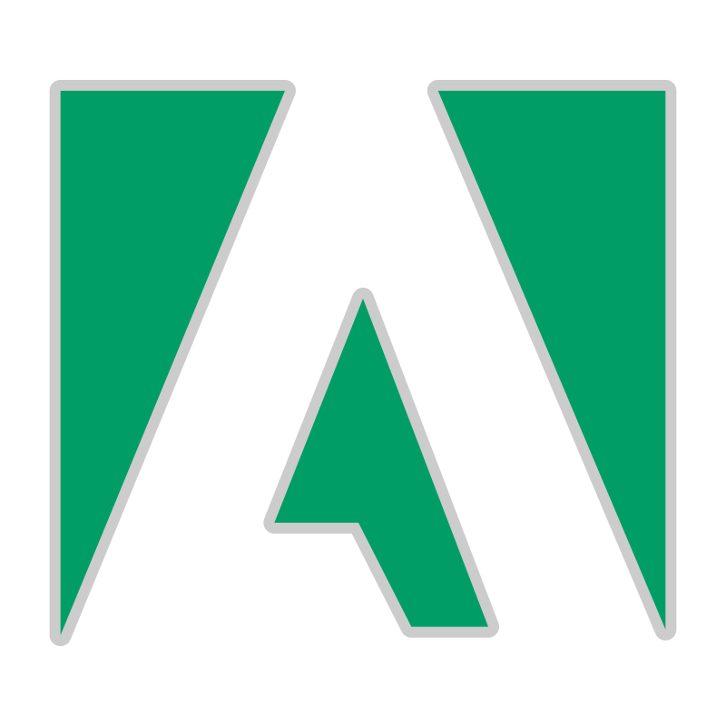

<a name="readme-top"></a>

  <!-- PROJECT LOGO -->

  <br />
  <div align="center">
    <a href="https://github.com/MeetTheAdenis">
      
    </a>
    <h3 align="center">My React Portfolio</h3>
    <p align="center">
    <br/>
This portfolio application was built using React and is designed to showcase my projects. It features a dynamic and visually appealing layout. <br/>
      <br/>
      Built by: Adenis Shala
      <br/>
      <br/>
      <a href="https://github.com/MeetTheAdenis"><strong>Explore the docs »</strong></a>
      <br/>
      <br/>
      <a href="#">View Live Website</a>
      ·
      <a href="https://github.com/MeetTheAdenis">Report Bug</a>
      ·
      <a href="https://github.com/MeetTheAdenis">Request Feature</a>
    </p>
  </div>
  
  <!-- TABLE OF CONTENTS -->

  <details>
    <summary>Table of Contents</summary>
    <ol>
      <li>
        <a href="#about-the-project">About The Project</a>
        <ul>
          <li><a href="#photos">Photos</a></li>
          <li><a href="#built-with">Built With</a></li>
          <li><a href="#description">Description</a></li>
        </ul>
      </li>
      <li>
          <a href="#getting-started">Getting Started</a>
        <ul>
          <li><a href="#prerequisites">Prerequisites</a></li>
          <li><a href="#installation">Installation</a></li>
        </ul>
      </li>
      <li>
          <a href="#usage">Usage</a>
        <ul>
          <li><a href="#mobile-responsive">Mobile Responsive</a></li>
        </ul>
      </li>
      <li><a href="#">License</a></li>
      <li><a href="#questions">Questions</a></li>
    </ol>
  </details>
  
  <!-- ABOUT THE PROJECT -->
  
  ## About The Project
  
  

  <p align="right"><a href="#readme-top">back to top</a></p>
  
  ### Built With
  
  - 

  <p align="right"><a href="#readme-top">back to top</a></p>
  
  ### Description
  
  This is the initial version of my portfolio website, built with React. It presents a comprehensive showcase of my projects. The design places a strong emphasis on a mobile-first approach, delivering a professional and polished look through the use of a carefully chosen color palette.
  
  <p align="right"><a href="#readme-top">back to top</a></p>

<!-- GETTING STARTED The Project HERE-->

## Getting Started

To get a local copy up and running follow these simple example steps.

### Prerequisites

- npm
  ```sh
  npm install npm@latest -g
  ```

### Installation

1. Clone the repo
   ```sh
   git clone https://github.com/MeetTheAdenis/Portfolio
   ```
2. Install NPM packages
   ```sh
   npm install
   ```

  <p align="right"><a href="#readme-top">back to top</a></p>
  
  <!-- USAGE EXAMPLES -->
  
  ## Usage  
  ### Mobile Responsive
  
  - As demonstrated in the photos below, this application is designed to be responsive and adjust seamlessly to fit various screen sizes
  

  <p align="right"><a href="#readme-top">back to top</a></p>

  <!-- LICENSE -->

## License

Distributed under the MIT License. See `LICENSE.md` for more information.

  <p align="right"><a href="#readme-top">back to top</a></p>
  
  
<!-- QUESTIONS -->
  
## Questions

If you have any inquiries, don't hesitate to reach out to me via socials or by sending an email to <a href="mailto:adenisshala8@gmail.com">adenisshala8@gmail.com</a>


  <p align="right"><a href="#readme-top">back to top</a></p>
  
## Deploy

1.If you want to DEPLOY, run this: npm run build
2.Then the Build file go and zip. Then upload the Build.zip nside public_html in ur host then unzip inside /public_html/


  <p align="right"><a href="#readme-top">back to top</a></p>
  

  <!-- UPDATE PLACEHOLDER IMAGES HERE -->


<!-- If you want to DEPLOY, run this: npm run build -->
<!-- Then the Build file go and zip. Then upload the Build.zip nside public_html in ur host then unzip inside /public_html/-->
